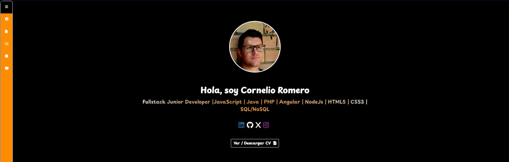
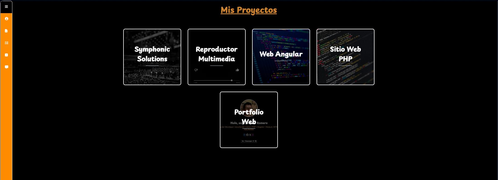
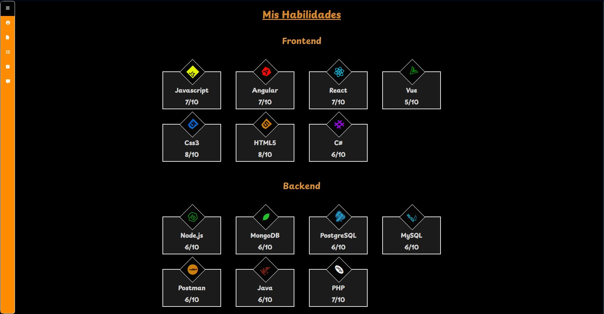

<h1>Portfolio Web Personal</h1>

Este repositorio contiene el código fuente de mi portfolio web personal, desarrollado con <strong>React</strong> y otras tecnologías web modernas. El portfolio tiene como objetivo mostrar mis proyectos, habilidades y experiencia profesional de manera interactiva y visualmente atractiva.

<h2>🚀 Tecnologías Utilizadas</h2>
<ul>
  <li><strong>React</strong>: Biblioteca de JavaScript para la creación de interfaces de usuario.</li>
  <li><strong>JavaScript</strong>: Lenguaje de programación principal para la funcionalidad.</li>
  <li><strong>HTML5</strong>: Estructura del contenido web.</li>
  <li><strong>CSS3</strong>: Estilización y diseño de la página.</li>
  <li><strong>Font Awesome</strong>: Conjunto de iconos vectoriales para mejorar la presentación.</li>
  <li><strong>Google Fonts</strong>: Tipografías personalizadas para una mejor apariencia.</li>
</ul>

<h2>⚙️ Características</h2>
<ul>
  <li><strong>Diseño Responsivo</strong>: Adaptado para dispositivos móviles, tabletas y escritorios.</li>
  <li><strong>Interfaz Intuitiva</strong>: Navegación fácil y experiencia de usuario fluida.</li>
  <li><strong>Animaciones Suaves</strong>: Animaciones de entrada y efectos visuales.</li>
  <li><strong>Sección de Proyectos</strong>: Descripción detallada de los proyectos con enlaces y capturas de pantalla.</li>
  <li><strong>Formulario de Contacto</strong>: Posibilidad de contactarme directamente a través del sitio.</li>
</ul>

<h2>🔧 Instalación y Configuración</h2>
<ol>
  <li><strong>Clonar el repositorio</strong>:
    <pre><code>git clone https://github.com/Nelius72/portfolio.git
cd portfolio</code></pre>
  </li>
  <li><strong>Instalar dependencias</strong>:
    <pre><code>npm install</code></pre>
  </li>
  <li><strong>Iniciar el servidor de desarrollo</strong>:
    <pre><code>npm start</code></pre>
  </li>
  <li><strong>Acceso</strong>: El proyecto estará disponible en <code>http://localhost:3000</code>.</li>
</ol>

<h2>📁 Estructura del Proyecto</h2>
<pre><code>portfolio/
│
├── public/
│   ├── index.html
│   └── ...
│
├── src/
│   ├── assets/           # Imágenes y otros recursos
│   ├── components/       # Componentes React reutilizables
│   ├── App.js            # Componente principal
│   ├── index.js          # Punto de entrada
│   
│
├── package.json
└── README.md
</code></pre>

<h2>📷 Capturas de Pantalla</h2>

<h2>📝 Licencia</h2>

Este proyecto está bajo la licencia MIT. Para más detalles, consulta el archivo <a href="LICENSE">LICENSE</a>.

<h2>📬 Contacto</h2>

<strong>Cornelio Romero Borrero</strong> 
<a href="mailto:cornelioromeroborrero@gmail.com">cornelioromeroborrero@gmail.com</a> 
<a href="www.linkedin.com/in/cornelio-romero-borrero-098055a5">LinkedIn</a>

